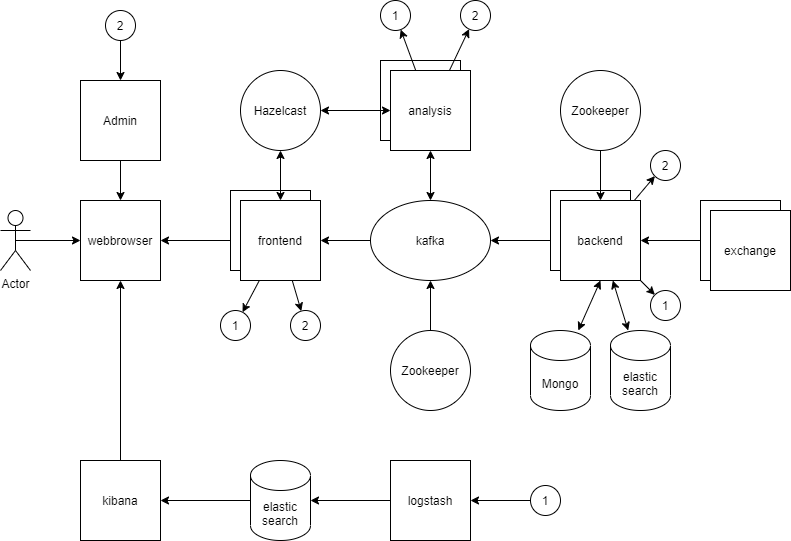

# Exchange Data PoC
A PoC to retrieve real-time Crypto Exchange data, as first step for an ordering bot! The code belongs to this
[YouTube serie](https://www.youtube.com/playlist?list=PLQkCUEPgDgc1dItDlEjQ-sTXjY7kR-76z).

## System Overview


## Run Application
Prebuild docker containers can be found on: [Docker hub](https://hub.docker.com/u/buildingsoftwareblocks).
A docker compose script is provided. Start the application with:

``
docker-compose --env-file env.dev up -d
``

With scaling:

``
docker-compose --env-file env.dev up --scale frontend=2 --scale backend=2 --scale analysis=2 -d
``

Create your own *env.dev* file from the *env.template* file.

During development, the supported services (kafka, mongoDB) can be useful. For this a seperate docker-compose file is
created. Use it with:

``
docker-compose -f docker-compose-dev.yml --env-file env.dev up -d
``

| System | link |
| ------- | --- |
| admin | http://localhost:8080/ |
| frontend | http://localhost:8081/ |
| log GUI | http://localhost:5601/ |

## Test Performance

Using testcontainers can be slow during testing, because the used containers are removed after the test. The article
[Reuse Containers With Testcontainers for Fast Integration Tests](https://rieckpil.de/reuse-containers-with-testcontainers-for-fast-integration-tests/)
tells how to make integration testing faster.

## MongoDB queries

The following queries show some useful information:

Number of records:

````mongodb
db.message.count()
````

Date values :

````mongodb
db.message.aggregate(
    [
        {
            $group:{
                _id: {
                    exchange: "$exchange"
                },
                "min date": {
                    $min : "$created"
                },
                "max date" : {
                    $max : "$created"
                },
                "#messages" : {
                    $sum:1
                }
            }
        }
    ]
    )
````

Message sizes:

````mongodb
db.message.aggregate(
    [
        {
            $project: {
                currencyPair: 1,
                exchange: 1,
                length: {
                    $strLenCP: "$message"
                }
            }
        },
        {
            $group:{
                _id: {
                    exchange: "$exchange",
                    currencypair:"$currencyPair"
                },
                "avg message" : {
                    $avg : "$length"
                },
                "max message" : {
                    $max : "$length"
                },
                "min message" : {
                    $min : "$length"
                },
                "#messages" : {
                    $sum:1
                },
                "volume" : {
                    $sum : "$length"
                }
            }
        }
    ]
    )
````

## Build Application
You can build the application locally via a [maven](https://maven.apache.org/) command:

| target | meaning |
| ------- | ------ |
mvn clean | clean environment
mvn install | build self executable JAR files
mvn install -P docker | build docker images
mvn versions:display-property-updates | check if latest versions of libraries are used.

## TODO List
- [x] 1 Exchange, 1 Currency pair connected
- [x] multiple services connected via Kafka
- [x] build pipeline
- [x] store events in database
- [x] multiple exchanges / multiple Currency pairs
- [x] orderbook analysis module
- [x] simple arbitrage
- [x] scalable backend module
- [x] scalable frontend module
- [x] scalable docker frontend
- [x] scalable analysis module
- [x] better logging
- [ ] Triangular Arbitrage
- [ ] better frontend GUI
- [ ] Binary messages in Kafka
- [ ] more robust error handling

## Related
- [Sonar cloud](https://sonarcloud.io/dashboard?id=buildingsoftwareblocks_exchange)
- [Docker hub](https://hub.docker.com/u/buildingsoftwareblocks)

## Background Information
- [Battle of the Bots: How Market Makers Fight It Out on Crypto Exchanges](https://medium.com/swlh/battle-of-the-bots-how-market-makers-fight-it-out-on-crypto-exchanges-2482eb937107)
- [known / XChange](https://github.com/knowm/XChange)
- [Using WebSocket to build an interactive web application](https://spring.io/guides/gs/messaging-stomp-websocket/)
- [Spring Websocket](https://docs.spring.io/spring-framework/docs/current/reference/html/web.html#websocket-stomp-handle-send)
- [Spring for Apache Kafka](https://docs.spring.io/spring-kafka/docs/current/reference/html/#even-quicker-with-spring-boot)
- [Spring Boot Reference Documentation](https://docs.spring.io/spring-boot/docs/current/maven-plugin/reference/htmlsingle/#build-image)
- [The Easy Cryptocurrency Arbitrage Trading Strategies](https://blog.shrimpy.io/blog/cryptocurrency-arbitrage-a-lucrative-trading-strategy)
